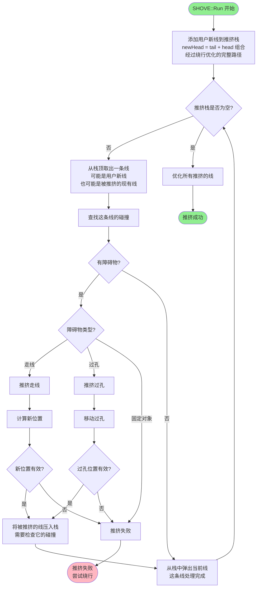
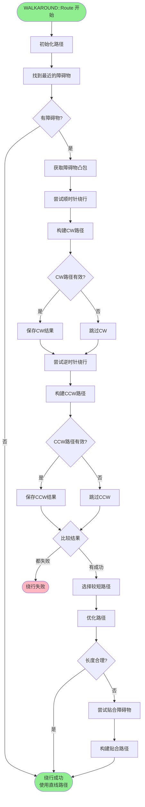
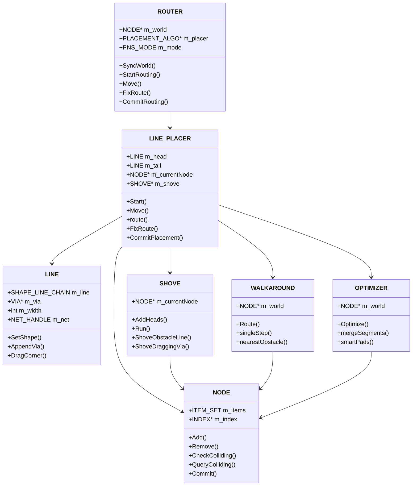
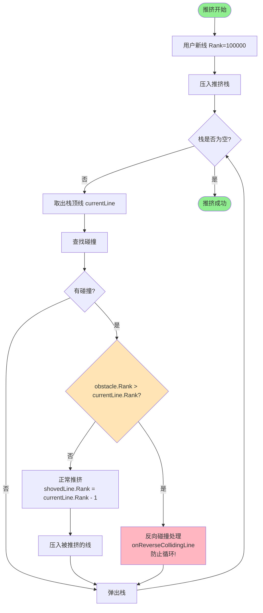

# KiCad 单根线布线完整流程图

## 主流程图

```mermaid
graph TB
    Start([用户点击布线工具或按X键]) --> Init[ROUTER_TOOL::MainLoop]
    
    Init --> PrepareRouter[准备路由器环境]
    PrepareRouter --> |初始化| SyncWorld[ROUTER::SyncWorld<br/>同步PCB世界状态]
    SyncWorld --> SetMode[设置模式: PNS_MODE_ROUTE_SINGLE]
    
    SetMode --> WaitClick[等待用户点击起点]
    WaitClick --> |用户点击| UpdateStart[updateStartItem<br/>识别起始对象]
    
    UpdateStart --> StartPlacement[LINE_PLACER::Start]
    StartPlacement --> InitLine[initPlacement<br/>初始化head和tail]
    InitLine --> CreateNode[创建NODE分支<br/>用于碰撞检测]
    CreateNode --> InitShove{布线模式?}
    
    InitShove --> |RM_Shove| CreateShove[创建SHOVE引擎]
    InitShove --> |RM_Walkaround| SkipShove[跳过SHOVE]
    InitShove --> |RM_MarkObstacles| SkipShove
    
    CreateShove --> MouseMove
    SkipShove --> MouseMove
    
    MouseMove[等待鼠标移动] --> |鼠标移动| Move[LINE_PLACER::Move]
    
    Move --> Route[LINE_PLACER::route]
    Route --> BuildInitial[buildInitialLine<br/>构建初始直线路径]
    
    BuildInitial --> CheckCollision{检测碰撞?}
    
    CheckCollision --> |无碰撞| DirectPath[直接使用路径]
    CheckCollision --> |有碰撞| ChooseStrategy{选择策略}
    
    ChooseStrategy --> |RM_Shove| ShoveAlgo[rhShoveOnly<br/>推挤算法]
    ChooseStrategy --> |RM_Walkaround| WalkAlgo[rhWalkOnly<br/>绕行算法]
    ChooseStrategy --> |RM_MarkObstacles| MarkAlgo[rhMarkObstacles<br/>标记障碍物]
    
    ShoveAlgo --> ShoveProcess[SHOVE::Run<br/>执行推挤]
    ShoveProcess --> ShoveResult{推挤结果?}
    ShoveResult --> |成功| UpdateHead
    ShoveResult --> |失败| TryWalk[尝试绕行]
    
    WalkAlgo --> WalkProcess[WALKAROUND::Route<br/>执行绕行]
    WalkProcess --> WalkTry{尝试绕行}
    WalkTry --> |顺时针| WalkCW[绕行CW]
    WalkTry --> |逆时针| WalkCCW[绕行CCW]
    WalkCW --> SelectBest[选择最短路径]
    WalkCCW --> SelectBest
    SelectBest --> Optimize[OPTIMIZER::Optimize<br/>优化路径]
    
    MarkAlgo --> MarkObs[高亮碰撞区域]
    
    TryWalk --> WalkProcess
    Optimize --> UpdateHead
    MarkObs --> UpdateHead
    DirectPath --> UpdateHead
    
    UpdateHead[更新head线段] --> HandleSelf[handleSelfIntersections<br/>处理自相交]
    HandleSelf --> HandlePull[handlePullback<br/>回退优化]
    HandlePull --> ReduceTail[reduceTail<br/>简化tail]
    ReduceTail --> TryMerge{head足够稳定?<br/>无锐角?<br/>长度>=3?}
    
    TryMerge --> |是| MergeHead[mergeHead<br/>将head稳定部分转移到tail<br/>tail变长 head变短]
    TryMerge --> |否| SkipMerge[跳过合并<br/>tail和head保持原样<br/>等待下次优化]
    
    MergeHead --> Display
    SkipMerge --> Display
    
    Display[显示预览路径<br/>head=临时 tail=已固定] --> WaitAction[等待用户操作]
    
    WaitAction --> |鼠标移动| MouseMove
    WaitAction --> |点击| FixSegment[LINE_PLACER::FixRoute<br/>用户确认固定当前段]
    WaitAction --> |ESC键| Cancel[取消布线]
    WaitAction --> |回车/双击| Finish[完成布线]
    
    FixSegment --> CommitSegments[将head线段提交到NODE<br/>创建SEGMENT对象]
    CommitSegments --> RemoveLoops{移除环路?}
    RemoveLoops --> |是| RemLoop[removeLoops<br/>删除冗余走线]
    RemoveLoops --> |否| SkipLoop[跳过]
    RemLoop --> SaveStage
    SkipLoop --> SaveStage
    
    SaveStage[保存到FIXED_TAIL] --> CheckEnd{到达终点?}
    CheckEnd --> |否| MouseMove
    CheckEnd --> |是| Finish
    
    Finish --> CommitRoute[LINE_PLACER::CommitPlacement]
    CommitRoute --> ApplyChanges[应用所有更改到BOARD]
    ApplyChanges --> UpdateRatsnest[更新飞线]
    UpdateRatsnest --> End([布线完成])
    
    Cancel --> Cleanup[清理临时数据]
    Cleanup --> End
    
    style Start fill:#90EE90
    style End fill:#FFB6C1
    style ShoveAlgo fill:#FFE4B5
    style WalkAlgo fill:#FFE4B5
    style MarkAlgo fill:#FFE4B5
    style Display fill:#87CEEB
```



## 推挤算法详细流程



## 绕行算法详细流程



## 关键数据结构



## 文件结构

```
pcbnew/router/
├── router_tool.cpp/h           # 用户界面层
├── pns_router.cpp/h            # 路由器核心
├── pns_line_placer.cpp/h       # 线路放置器
├── pns_shove.cpp/h             # 推挤算法
├── pns_walkaround.cpp/h        # 绕行算法
├── pns_optimizer.cpp/h         # 路径优化器
├── pns_node.cpp/h              # 世界状态和碰撞检测
├── pns_line.cpp/h              # 线段几何
├── pns_item.cpp/h              # 基础项目类
├── pns_via.cpp/h               # 过孔
├── pns_segment.cpp/h           # 线段
├── pns_solid.cpp/h             # 固定对象（焊盘等）
├── pns_topology.cpp/h          # 拓扑分析
└── pns_kicad_iface.cpp/h       # KiCad接口
```

## 如何使用此文件

### 方法 1：在线渲染
访问以下网站并粘贴 Mermaid 代码：
- https://mermaid.live/
- https://mermaid.ink/

### 方法 2：VS Code 插件
安装 "Markdown Preview Mermaid Support" 插件，然后预览此文件

### 方法 3：GitHub/GitLab
直接在 GitHub 或 GitLab 上查看此 Markdown 文件，它们原生支持 Mermaid

### 方法 4：导出为图片
使用 mermaid-cli 工具：
```bash
npm install -g @mermaid-js/mermaid-cli
mmdc -i kicad_single_line_routing_flow.md -o routing_flow.png
```

## 流程说明

### 阶段 1：初始化
- 用户触发布线工具
- 同步 PCB 状态
- 设置布线模式

### 阶段 2：开始布线
- 识别起始对象
- 初始化 head 和 tail
- 创建碰撞检测环境

### 阶段 3：交互式布线
- 鼠标移动触发路径计算
- 根据模式选择算法（推挤/绕行/标记）
- 实时显示预览

### 阶段 4：路径优化
- 处理自相交
- 回退优化
- 简化路径
- 合并线段

### 阶段 5：固定和完成
- 固定当前段
- 移除环路
- 提交到 BOARD
- 更新显示

## 关键算法

### 推挤算法（Shove）
- 遇到障碍物时推开现有走线
- 递归推挤受影响的走线
- 验证所有走线满足设计规则

### 绕行算法（Walkaround）
- 计算障碍物凸包
- 尝试顺时针和逆时针绕行
- 选择最短有效路径

### 优化算法（Optimizer）
- 合并共线线段
- 移除不必要的顶点
- 智能焊盘连接优化


## 重要概念：Head 和 Tail 的两次"合并"

### 概念解释

在 KiCad 的布线过程中，走线由两部分组成：

```
起点 ----[Tail 已固定部分]----[Head 临时部分]---- 鼠标位置
```

- **Tail（尾部）**：已经确定并固定的走线部分，不会再改变
- **Head（头部）**：跟随鼠标移动的临时走线部分，实时计算

### 第一次"合并"：mergeHead（自动优化合并）

**位置**：在每次鼠标移动的 `Move()` 循环中

**时机**：实时、自动、每次鼠标移动都可能触发

**目的**：将 head 中已经稳定的部分转移到 tail，减少计算量

**条件**：
```cpp
bool LINE_PLACER::mergeHead()
{
    // 1. head 必须足够长（至少3个线段）
    if( n_head < 3 )
        return false;
    
    // 2. head 和 tail 必须连续
    if( n_tail && head.CPoint(0) != tail.CLastPoint() )
        return false;
    
    // 3. head 中不能有锐角或不合法的角度
    if( m_head.CountCorners( ForbiddenAngles ) != 0 )
        return false;
    
    // 4. head 和 tail 的连接处不能是锐角
    if( dir_head.Angle( dir_tail ) & ForbiddenAngles )
        return false;
    
    // 满足条件后：
    tail.Append( head );  // 将 head 追加到 tail
    head.Clear();         // 清空 head，准备接收新的临时线段
}
```

**效果**：
```
合并前：
Tail: A---B---C
Head: C---D---E---F (鼠标在F)

合并后：
Tail: A---B---C---D---E
Head: E---F (只保留最后一小段)
```

**特点**：
- ✓ 自动的、透明的
- ✓ 用户无感知
- ✓ 优化性质，提高性能
- ✓ 可能不发生（条件不满足时）

### 第二次"合并"：FixRoute（用户确认固定）

**位置**：用户点击确认当前段时

**时机**：用户主动触发（点击鼠标）

**目的**：将当前的 head 永久固定，创建实际的 SEGMENT 对象

**过程**：
```cpp
bool LINE_PLACER::FixRoute( const VECTOR2I& aP, ITEM* aEndItem, bool aForceFinish )
{
    LINE pl = Trace();  // 获取完整路径（tail + head）
    
    // 1. 检查碰撞（如果不允许 DRC 违规）
    if( !Settings().AllowDRCViolations() )
    {
        if( checkNode->CheckColliding( &pl ) )
            return false;  // 有碰撞，不能固定
    }
    
    // 2. 将 head 中的线段转换为实际的 SEGMENT 对象
    for( int i = 0; i < lastV; i++ )
    {
        seg = SEGMENT( pl.CSegment(i), m_currentNet );
        seg.SetWidth( pl.Width() );
        seg.SetLayer( m_currentLayer );
        m_lastNode->Add( std::make_unique<SEGMENT>(seg) );
    }
    
    // 3. 如果有过孔，也添加
    if( pl.EndsWithVia() )
        m_lastNode->Add( Clone( pl.Via() ) );
    
    // 4. 如果不是终点，准备下一段布线
    if( !realEnd )
    {
        m_currentStart = p_last;      // 新起点
        m_head.Line().Clear();        // 清空 head
        m_tail.Line().Clear();        // 清空 tail
        m_fixedTail.AddStage(...);    // 保存到历史
        // 继续布线...
    }
    else
    {
        m_idle = true;  // 布线完成
    }
}
```

**效果**：
```
固定前（内存中的临时对象）：
Tail: LINE 对象（SHAPE_LINE_CHAIN）
Head: LINE 对象（SHAPE_LINE_CHAIN）

固定后（PCB 中的实际对象）：
NODE 中添加了：
- SEGMENT 对象 1
- SEGMENT 对象 2
- SEGMENT 对象 3
- VIA 对象（如果有）
```

**特点**：
- ✓ 用户主动触发
- ✓ 创建实际的 PCB 对象
- ✓ 不可撤销（除非整体撤销）
- ✓ 必须发生（否则走线不会被保存）

### 对比总结

| 特性 | mergeHead（第一次） | FixRoute（第二次） |
|------|-------------------|-------------------|
| **触发时机** | 每次鼠标移动 | 用户点击确认 |
| **是否自动** | 自动 | 手动 |
| **目的** | 优化性能 | 固定走线 |
| **操作对象** | LINE 对象内部 | 创建 SEGMENT 对象 |
| **可见性** | 用户无感知 | 用户主动操作 |
| **可撤销性** | 可以（通过鼠标移动） | 需要整体撤销 |
| **是否必须** | 否（优化） | 是（保存） |
| **数据变化** | Tail 变长，Head 变短 | 创建实际 PCB 对象 |

### 实际例子

假设用户要从 A 点布线到 E 点：

```
1. 用户点击 A 点开始
   Tail: 空
   Head: 空

2. 鼠标移动到 B 点
   Tail: 空
   Head: A---B

3. 鼠标移动到 C 点
   Tail: 空
   Head: A---B---C

4. 鼠标移动到 D 点（触发 mergeHead）
   Tail: A---B---C      ← 第一次"合并"（自动）
   Head: C---D

5. 用户点击确认
   → FixRoute 执行      ← 第二次"合并"（手动）
   → 创建 SEGMENT(A-B), SEGMENT(B-C), SEGMENT(C-D)
   → 清空 Tail 和 Head
   → 准备下一段

6. 鼠标移动到 E 点
   Tail: 空
   Head: D---E

7. 用户双击完成
   → FixRoute 执行
   → 创建 SEGMENT(D-E)
   → 布线完成
```

### 为什么需要两次"合并"？

**第一次（mergeHead）的必要性：**
- 减少 head 的长度，提高碰撞检测速度
- 避免重复计算已经稳定的部分
- 使路径优化更高效

**第二次（FixRoute）的必要性：**
- 将临时的几何对象转换为实际的 PCB 对象
- 保存到 NODE 的数据结构中
- 使走线可以被持久化到文件

两者配合，既保证了实时交互的流畅性，又确保了数据的正确保存。


## 常见误解：什么是"保持分离"？

### 误解

很多人看到流程图中的"保持分离"或"跳过合并"，会误以为：
- ❌ Head 和 Tail 断开了
- ❌ 走线不连续了
- ❌ 需要重新连接

### 真相

**"跳过合并"的真正含义是：**
- ✓ Head 和 Tail 仍然连续（Head 起点 = Tail 终点）
- ✓ 只是不执行优化操作
- ✓ 保持当前的 Tail/Head 划分不变
- ✓ 等待下次鼠标移动时再尝试

### 图示说明

```
┌─────────────────────────────────────────────────────────┐
│ 状态：跳过合并（Head 和 Tail 仍然连续）                  │
└─────────────────────────────────────────────────────────┘

  起点                                            鼠标位置
   A                                                  G
   │                                                  │
   ▼                                                  ▼
   ●───────●───────●───────●───────●───────●───────●
   A       B       C       D       E       F       G
   
   └───────────────┘       └───────────────────────┘
      Tail (固定)              Head (临时)
                   ↑
                连接点 C
                (连续的！)

说明：
- Tail 结束于 C 点
- Head 开始于 C 点
- 它们在 C 点连接，是连续的
- 只是没有执行"将 D-E-F 转移到 Tail"的操作
```

### 为什么会跳过合并？

#### 原因 1：Head 太短

```cpp
if( n_head < 3 )
    return false;  // Head 少于 3 个线段，太短了
```

```
Tail: A───B───C
Head: C───D        ← 只有 1 个线段，太短
      
结果：跳过合并，等 Head 变长
```

#### 原因 2：有锐角

```cpp
if( m_head.CountCorners( ForbiddenAngles ) != 0 )
    return false;  // Head 中有锐角或不合法角度
```

```
Tail: A───B───C
Head: C───D
          ╲
           E    ← 这里有个锐角
          /
         F
      
结果：跳过合并，等角度优化后再说
```

#### 原因 3：连接处角度不合法

```cpp
if( dir_head.Angle( dir_tail ) & ForbiddenAngles )
    return false;  // Tail 和 Head 的连接处角度不合法
```

```
Tail: A───B───C
              ╲
Head:          D───E───F  ← C-D 的角度太小
      
结果：跳过合并，避免固化不良角度
```

### 实际运行示例

```
时刻 1：鼠标移动到 D
━━━━━━━━━━━━━━━━━━━━━━━━━━━━━━━━━━━━━━━━
Tail: A───B
Head: B───C───D
检查：Head 长度 = 2，太短
结果：跳过合并
━━━━━━━━━━━━━━━━━━━━━━━━━━━━━━━━━━━━━━━━

时刻 2：鼠标移动到 E
━━━━━━━━━━━━━━━━━━━━━━━━━━━━━━━━━━━━━━━━
Tail: A───B
Head: B───C───D───E
检查：Head 长度 = 3，但有锐角
结果：跳过合并
━━━━━━━━━━━━━━━━━━━━━━━━━━━━━━━━━━━━━━━━

时刻 3：鼠标移动到 F（角度变好了）
━━━━━━━━━━━━━━━━━━━━━━━━━━━━━━━━━━━━━━━━
Tail: A───B
Head: B───C───D───E───F
检查：Head 长度 = 4，无锐角 ✓
结果：执行合并！
      ↓
Tail: A───B───C───D───E
Head: E───F
━━━━━━━━━━━━━━━━━━━━━━━━━━━━━━━━━━━━━━━━
```

### 关键点

1. **"跳过合并"不是错误**
   - 这是正常的优化策略
   - 系统在等待更好的时机

2. **Head 和 Tail 始终连续**
   - 即使跳过合并
   - 用户看到的是完整的走线

3. **下次鼠标移动会重试**
   - 每次 Move() 都会尝试 mergeHead()
   - 条件满足时自动合并

4. **对用户透明**
   - 用户看不到这个过程
   - 只看到流畅的布线体验

### 代码验证

```cpp
bool LINE_PLACER::mergeHead()
{
    SHAPE_LINE_CHAIN& head = m_head.Line();
    SHAPE_LINE_CHAIN& tail = m_tail.Line();
    
    int n_head = head.ShapeCount();
    int n_tail = tail.ShapeCount();
    
    // 检查 1：Head 太短？
    if( n_head < 3 )
    {
        PNS_DBG( Dbg(), Message, "Merge failed: not enough head segs." );
        return false;  // ← 跳过合并，返回 false
    }
    
    // 检查 2：不连续？
    if( n_tail && head.CPoint(0) != tail.CLastPoint() )
    {
        PNS_DBG( Dbg(), Message, "Merge failed: head and tail discontinuous." );
        return false;  // ← 跳过合并，返回 false
    }
    
    // 检查 3：有锐角？
    if( m_head.CountCorners( ForbiddenAngles ) != 0 )
        return false;  // ← 跳过合并，返回 false
    
    // 所有检查通过，执行合并
    tail.Append( head );  // ← 这里才真正合并
    head.Remove( 0, -1 );
    
    return true;  // ← 合并成功
}
```

### 总结

**"跳过合并"** = **"暂时不优化，保持现状"**

- 不是断开连接
- 不是出错
- 只是等待更好的时机
- Head 和 Tail 始终连续


## 推挤队列中的线是什么？

### 常见误解

很多人认为推挤队列中只有 **head**（跟随鼠标的临时部分），但实际上：

**推挤队列中的线 = tail + head 的完整路径**

### 代码证据

```cpp
bool LINE_PLACER::rhShoveOnly( const VECTOR2I& aP, LINE& aNewHead, LINE& aNewTail )
{
    LINE walkSolids;
    bool viaOk = false;
    
    // 步骤 1：用绕行算法处理固定对象（焊盘、过孔等）
    // 这一步会生成 tail + head 的完整路径
    if( ! rhWalkBase( aP, walkSolids, ITEM::SOLID_T, RM_Shove, viaOk ) )
        return false;
    
    // 步骤 2：walkSolids 是什么？
    // 在 rhWalkBase 内部：
    //   LINE initTrack( m_tail );              // 从 tail 开始
    //   initTrack.Line().Append( l1.CLine() ); // 追加 head
    //   walkaround.Route( initTrack );         // 绕行优化
    //   walkSolids = 优化后的完整路径
    
    // 步骤 3：创建要推挤的线
    LINE newHead( walkSolids );  // ← 这是 tail+head 的完整路径！
    
    // 步骤 4：添加到推挤队列
    m_shove->ClearHeads();
    m_shove->AddHeads( newHead, SHOVE::SHP_SHOVE );  // ← 推挤完整路径
    
    // 步骤 5：执行推挤
    bool shoveOk = m_shove->Run() == SHOVE::SH_OK;
}
```

### 为什么需要完整路径？

#### 原因 1：推挤需要知道起点

```
如果只推挤 head：
  Tail: A───B───C (不知道)
  Head: C───D───E (只推挤这部分)
  
问题：推挤算法不知道线从哪里来，无法正确计算推挤方向

正确做法：
  完整路径: A───B───C───D───E
  推挤算法知道整条线的走向，可以正确推挤
```

#### 原因 2：避免推挤已固定的部分

虽然传入完整路径，但推挤算法会：
1. 识别哪些部分已经固定（tail）
2. 只推挤新的部分（head）
3. 保持已固定部分不变

#### 原因 3：计算推挤影响范围

```
完整路径可以帮助计算：
- 推挤的起始位置
- 推挤的方向
- 推挤的力度
- 受影响的其他走线
```

### 实际例子

```
场景：用户从 A 点布线到 E 点，遇到障碍物

步骤 1：用户已经固定了 A-B-C
━━━━━━━━━━━━━━━━━━━━━━━━━━━━━━━━━━━━━━━━
  Tail: A───B───C
  Head: 空
━━━━━━━━━━━━━━━━━━━━━━━━━━━━━━━━━━━━━━━━

步骤 2：鼠标移动到 E，生成 head
━━━━━━━━━━━━━━━━━━━━━━━━━━━━━━━━━━━━━━━━
  Tail: A───B───C
  Head: C───D───E
  
  遇到障碍物 X：
       X
      ╱ ╲
     ╱   ╲
    C─────D───E
━━━━━━━━━━━━━━━━━━━━━━━━━━━━━━━━━━━━━━━━

步骤 3：调用 rhShoveOnly
━━━━━━━━━━━━━━━━━━━━━━━━━━━━━━━━━━━━━━━━
  // 先绕过固定对象（焊盘等）
  rhWalkBase() 生成：
    walkSolids = A───B───C───D'───E'  (绕过焊盘)
  
  // 创建推挤线（完整路径）
  newHead = A───B───C───D'───E'
  
  // 添加到推挤队列
  m_shove->AddHeads( newHead )
━━━━━━━━━━━━━━━━━━━━━━━━━━━━━━━━━━━━━━━━

步骤 4：推挤算法执行
━━━━━━━━━━━━━━━━━━━━━━━━━━━━━━━━━━━━━━━━
  推挤算法看到完整路径：A───B───C───D'───E'
  
  检测到与现有走线 Y 碰撞：
       X
      ╱ ╲
     ╱   ╲
    C─────D'───E'
           ╲
            Y (现有走线)
  
  推挤 Y：
       X
      ╱ ╲
     ╱   ╲
    C─────D'───E'
            ╲
             Y' (推挤后)
━━━━━━━━━━━━━━━━━━━━━━━━━━━━━━━━━━━━━━━━

步骤 5：推挤成功，分离 head 和 tail
━━━━━━━━━━━━━━━━━━━━━━━━━━━━━━━━━━━━━━━━
  推挤后的完整路径：A───B───C───D'───E'
  
  分离为：
    newTail: A───B───C───D'
    newHead: D'───E'
━━━━━━━━━━━━━━━━━━━━━━━━━━━━━━━━━━━━━━━━
```

### 关键数据结构

```cpp
// SHOVE 类中的数据结构
struct HEAD_LINE_ENTRY
{
    std::optional<LINE> origHead;  // 原始的完整路径（tail+head）
    std::optional<LINE> newHead;   // 推挤后的完整路径
    int policy;                    // 推挤策略
    bool geometryModified;         // 几何是否被修改
};

std::vector<HEAD_LINE_ENTRY> m_headLines;  // 推挤队列
```

### 其他场景

#### 差分对布线

```cpp
// 差分对需要同时推挤两条线
m_shove->ClearHeads();
m_shove->AddHeads( pLine );  // 正线（完整路径）
m_shove->AddHeads( nLine );  // 负线（完整路径）
m_shove->Run();
```

#### 拖拽

```cpp
// 拖拽时推挤被拖拽的线
m_shove->ClearHeads();
m_shove->AddHeads( draggedLine, SHOVE::SHP_SHOVE );  // 完整的被拖拽线
m_shove->Run();
```

### 总结

| 问题 | 答案 |
|------|------|
| 推挤队列中是什么？ | tail + head 的完整路径 |
| 为什么不只是 head？ | 需要知道起点和整体走向 |
| tail 会被推挤吗？ | 不会，只推挤新的部分 |
| 如何区分 tail 和 head？ | 通过 splitHeadTail 函数分离 |
| 推挤后如何处理？ | 分离为新的 tail 和 head |

**核心理解：**
- **输入**：完整路径（tail + head）
- **处理**：推挤碰撞的部分
- **输出**：新的完整路径
- **分离**：重新划分为 tail 和 head


## 推挤栈的工作原理

### 核心概念

**推挤栈（m_lineStack）不是简单的队列，而是一个动态增长的栈，包含所有需要检查碰撞的线。**

### 栈中的线包括

1. **用户的新线**（初始）
   - tail + head 的完整路径
   - 第一个被压入栈

2. **被推挤的现有线**（动态添加）
   - 每次推挤产生新的线
   - 新线需要检查是否又碰撞了其他线
   - 形成连锁反应

### 完整工作流程

```cpp
// 1. 初始化：添加用户新线
m_shove->ClearHeads();
m_shove->AddHeads( newHead );  // newHead = tail + head

// 2. 执行推挤
SHOVE::Run()
{
    // 将用户新线压入栈
    pushLineStack( head );
    
    // 主循环：处理栈中的所有线
    while( !m_lineStack.empty() )
    {
        // 从栈顶取出一条线
        LINE currentLine = m_lineStack.back();
        
        // 查找碰撞
        NODE::OPT_OBSTACLE nearest = m_currentNode->NearestObstacle( &currentLine );
        
        if( !nearest )
        {
            // 没有碰撞，弹出这条线
            m_lineStack.pop_back();
            continue;
        }
        
        // 有碰撞，推挤障碍物
        ITEM* obstacle = nearest->m_item;
        
        if( obstacle->Kind() == ITEM::SEGMENT_T )
        {
            // 组装障碍线
            LINE obstacleLine = assembleLine( (SEGMENT*)obstacle );
            
            // 推挤这条线
            LINE shovedLine;
            if( ShoveObstacleLine( currentLine, obstacleLine, shovedLine ) )
            {
                // 推挤成功，将新线压入栈
                m_lineStack.push_back( shovedLine );  // ← 栈增长！
            }
        }
        
        // 当前线处理完成，弹出
        m_lineStack.pop_back();
    }
    
    // 栈空了，推挤完成
}
```

### 详细示例：连锁推挤

```
场景：用户布线遇到三条现有走线

初始 PCB 状态：
━━━━━━━━━━━━━━━━━━━━━━━━━━━━━━━━━━━━━━━━
  线 A: ═══════════
  线 B:     ═══════════
  线 C:         ═══════════
  
  用户新线:  ║
             ║  ← 会碰撞线 A
             ║
━━━━━━━━━━━━━━━━━━━━━━━━━━━━━━━━━━━━━━━━

推挤过程：
━━━━━━━━━━━━━━━━━━━━━━━━━━━━━━━━━━━━━━━━
【初始状态】
栈：[用户新线]
PCB：线A, 线B, 线C 在原位

【迭代 1】
取出：用户新线
检查：与线 A 碰撞
推挤：线 A 向下移动 → 线 A'
操作：
  - 弹出：用户新线（处理完成）
  - 压入：线 A'（需要检查）
栈：[线 A']
PCB：用户新线已放置, 线A→线A', 线B, 线C

【迭代 2】
取出：线 A'
检查：与线 B 碰撞（因为 A' 移下来了）
推挤：线 B 向下移动 → 线 B'
操作：
  - 弹出：线 A'（处理完成）
  - 压入：线 B'（需要检查）
栈：[线 B']
PCB：用户新线, 线A', 线B→线B', 线C

【迭代 3】
取出：线 B'
检查：与线 C 碰撞（因为 B' 移下来了）
推挤：线 C 向下移动 → 线 C'
操作：
  - 弹出：线 B'（处理完成）
  - 压入：线 C'（需要检查）
栈：[线 C']
PCB：用户新线, 线A', 线B', 线C→线C'

【迭代 4】
取出：线 C'
检查：无碰撞（下面没有其他线了）
操作：
  - 弹出：线 C'（处理完成）
栈：[]  ← 栈空了！
PCB：用户新线, 线A', 线B', 线C' 全部就位

【结果】
推挤成功！
- 用户新线：成功放置
- 线 A：被推到位置 A'
- 线 B：被推到位置 B'（连锁反应）
- 线 C：被推到位置 C'（连锁反应）
━━━━━━━━━━━━━━━━━━━━━━━━━━━━━━━━━━━━━━━━
```

### 栈的动态变化

```
时间轴：栈的内容变化

t0: [用户新线]                    ← 初始
    ↓ 处理用户新线，推挤线A
    
t1: [线A']                        ← 用户新线弹出，线A'压入
    ↓ 处理线A'，推挤线B
    
t2: [线B']                        ← 线A'弹出，线B'压入
    ↓ 处理线B'，推挤线C
    
t3: [线C']                        ← 线B'弹出，线C'压入
    ↓ 处理线C'，无碰撞
    
t4: []                            ← 线C'弹出，栈空，完成！
```

### 为什么用栈而不是队列？

**栈（LIFO - 后进先出）的优势：**

1. **深度优先处理**
   - 先处理最新的碰撞
   - 快速发现推挤失败
   - 减少不必要的计算

2. **局部性原理**
   - 相邻的推挤通常相关
   - 栈保持了空间局部性

3. **回溯方便**
   - 如果推挤失败，容易回退
   - 栈的结构天然支持回溯

### 推挤失败的情况

```
场景：推挤遇到固定对象

【迭代 N】
取出：线 X'
检查：与焊盘碰撞
推挤：失败！（焊盘不能移动）
结果：
  - 返回 SH_INCOMPLETE
  - 整个推挤失败
  - 尝试绕行算法
```

### 代码中的关键函数

```cpp
// 压入栈
bool SHOVE::pushLineStack( const LINE& aLine )
{
    m_lineStack.push_back( aLine );
    return true;
}

// 弹出栈
void SHOVE::popLineStack()
{
    m_lineStack.pop_back();
}

// 检查栈是否为空
while( !m_lineStack.empty() )
{
    // 处理栈顶的线
}
```

### 总结

| 概念 | 说明 |
|------|------|
| **推挤栈** | 存储所有需要检查碰撞的线 |
| **初始内容** | 用户的新线（tail+head） |
| **动态增长** | 每次推挤产生新线就压入 |
| **处理方式** | 从栈顶取出，检查，弹出 |
| **完成条件** | 栈为空 |
| **失败条件** | 遇到不能推挤的对象 |

**关键理解：**
- 不是"逐个处理 tail+head"
- 而是"逐个处理栈中的所有线"
- 栈中的线包括用户新线和所有被推挤的现有线
- 形成连锁反应，直到没有碰撞


## 防止死循环的保护机制

### 问题：为什么不会死循环？

推挤算法确实可能陷入死循环，例如：
```
线 A 推挤线 B
线 B 推挤线 C
线 C 推挤线 A  ← 循环！
```

### KiCad 的多重保护机制

KiCad 使用了 **5 层保护机制** 来防止死循环，确保推挤算法在任何情况下都能快速失败而不是卡死。

#### 1. 迭代次数限制（硬限制）

```cpp
SHOVE::SHOVE_STATUS SHOVE::shoveMainLoop()
{
    // 默认限制：250 次迭代
    int iterLimit = Settings().ShoveIterationLimit();  // 默认 250
    
    m_iter = 0;
    
    while( !m_lineStack.empty() )
    {
        st = shoveIteration( m_iter );
        m_iter++;
        
        // 检查迭代次数
        if( m_iter >= iterLimit )
        {
            st = SH_INCOMPLETE;  // 推挤失败
            break;
        }
    }
}
```

**配置：**
```cpp
// 在 pns_routing_settings.cpp 中
m_shoveIterationLimit = 250;  // 默认值
```

**效果：**
- 最多执行 250 次推挤迭代
- 超过限制 → 推挤失败 → 尝试绕行算法
- 这是最后的安全网

#### 2. 时间限制（硬限制）

```cpp
SHOVE::SHOVE_STATUS SHOVE::shoveMainLoop()
{
    // 默认限制：1000 毫秒（1秒）
    TIME_LIMIT timeLimit = Settings().ShoveTimeLimit();  // 默认 1000ms
    
    timeLimit.Restart();
    
    while( !m_lineStack.empty() )
    {
        st = shoveIteration( m_iter );
        
        // 检查时间
        if( timeLimit.Expired() )
        {
            st = SH_INCOMPLETE;  // 推挤失败
            break;
        }
    }
}
```

**配置：**
```cpp
m_shoveTimeLimit = 1000;  // 1000 毫秒
```

**效果：**
- 最多运行 1 秒
- 超时 → 推挤失败 → 尝试绕行
- 保证用户界面不会卡死

#### 3. Rank（优先级）机制 - 最关键的防循环机制！

**核心思想：每条线都有优先级，不能推挤比自己优先级更高的线**

这是防止循环的 **核心机制**，通过优先级系统确保推挤是单向的、不可逆的。

```cpp
// 在 SHOVE::Run() 中，用户新线的 Rank 设置为最高
head.SetRank( 100000 );

// 在 shoveIteration() 中检查 Rank
if( !ni->OfKind( ITEM::SOLID_T ) && ni->Rank() >= 0 && ni->Rank() > currentLine.Rank() )
{
    // 碰撞的线 Rank 更高 → 这是已经推挤过的线
    // 反向处理，避免循环
    st = onReverseCollidingLine( ... );
}
else
{
    // 正常推挤，降低 Rank
    shovedLine.SetRank( currentLine.Rank() - 1 );
}
```

**工作原理：**

```
初始状态：
━━━━━━━━━━━━━━━━━━━━━━━━━━━━━━━━━━━━━━━━
用户新线：Rank = 100000  ← 最高优先级
线 A：    Rank = 0       ← 默认优先级
线 B：    Rank = 0
线 C：    Rank = 0
━━━━━━━━━━━━━━━━━━━━━━━━━━━━━━━━━━━━━━━━

迭代 1：用户新线(100000) 推挤线 A
━━━━━━━━━━━━━━━━━━━━━━━━━━━━━━━━━━━━━━━━
检查：100000 > 0 ✓ 可以推挤
推挤：线 A → 线 A'
设置：线 A' 的 Rank = 99999  ← 降低 1
压栈：线 A' 压入推挤栈
━━━━━━━━━━━━━━━━━━━━━━━━━━━━━━━━━━━━━━━━

迭代 2：线 A'(99999) 推挤线 B
━━━━━━━━━━━━━━━━━━━━━━━━━━━━━━━━━━━━━━━━
检查：99999 > 0 ✓ 可以推挤
推挤：线 B → 线 B'
设置：线 B' 的 Rank = 99998  ← 降低 1
压栈：线 B' 压入推挤栈
━━━━━━━━━━━━━━━━━━━━━━━━━━━━━━━━━━━━━━━━

迭代 3：线 B'(99998) 碰到线 A'(99999)
━━━━━━━━━━━━━━━━━━━━━━━━━━━━━━━━━━━━━━━━
检查：99998 < 99999 ✗ 不能推挤！
原因：线 A' 的 Rank 更高，说明它是之前推挤的结果
处理：调用 onReverseCollidingLine()
      尝试反向推挤或者失败
结果：循环被阻止！
━━━━━━━━━━━━━━━━━━━━━━━━━━━━━━━━━━━━━━━━
```

**防止循环的关键代码：**
```cpp
// 在 pns_shove.cpp 的 shoveIteration() 函数中
if( !ni->OfKind( ITEM::SOLID_T ) && ni->Rank() >= 0 && ni->Rank() > currentLine.Rank() )
{
    // 碰到 Rank 更高的线 → 这是已经推挤过的
    // 不能再推挤它，否则会形成循环
    // 采用反向碰撞处理（onReverseCollidingLine）
    
    switch( ni->Kind() )
    {
    case ITEM::VIA_T:
        st = onReverseCollidingVia( currentLine, (VIA*) ni, *nearest );
        break;
    case ITEM::SEGMENT_T:
    case ITEM::ARC_T:
        LINE revLine = assembleLine( ni );
        st = onCollidingLine( revLine, currentLine, revLine.Rank() + 1 );
        break;
    }
}
```

**Rank 机制的优势：**
- ✓ 数学上保证不会循环（单调递减）
- ✓ 每次推挤都降低优先级
- ✓ 不能推挤更高优先级的线
- ✓ 最多推挤 100000 次（理论上）
- ✓ 实际上配合迭代限制，非常安全

**Rank 机制流程图：**



#### 4. 栈深度隐式限制

虽然没有显式的栈深度限制，但：
- 迭代次数限制间接限制了栈的增长
- 每次迭代都会弹出一条线
- 最多压入的线数 ≤ 迭代次数限制
- 栈深度不会超过 250（默认迭代限制）

#### 5. 固定对象检测（立即失败）

```cpp
// 在 shoveIteration() 中
if( ni->OfKind( ITEM::SOLID_T ) )
{
    // 碰到固定对象（焊盘、过孔等）
    // 不能推挤 → 立即失败
    st = onCollidingSolid( currentLine, ni, *nearest );
    // 如果无法绕行，返回 SH_INCOMPLETE
}
```

**效果：**
- 遇到不能移动的对象（焊盘、固定过孔等）立即停止
- 避免无限尝试推挤不可移动的对象
- 快速失败，尝试其他策略

### 完整的保护流程

```cpp
SHOVE::SHOVE_STATUS SHOVE::shoveMainLoop()
{
    int iterLimit = Settings().ShoveIterationLimit();     // 保护 1: 迭代限制
    TIME_LIMIT timeLimit = Settings().ShoveTimeLimit();   // 保护 2: 时间限制
    
    m_iter = 0;
    timeLimit.Restart();
    
    while( !m_lineStack.empty() )
    {
        LINE currentLine = m_lineStack.back();
        
        // 查找碰撞
        NODE::OPT_OBSTACLE nearest = m_currentNode->NearestObstacle( &currentLine );
        
        if( !nearest )
        {
            // 无碰撞，弹出当前线
            m_lineStack.pop_back();
            continue;
        }
        
        ITEM* ni = nearest->m_item;
        
        // 保护 5：固定对象检测
        if( ni->OfKind( ITEM::SOLID_T ) )
        {
            // 尝试绕行，如果失败则返回 SH_INCOMPLETE
            st = onCollidingSolid( currentLine, ni, *nearest );
            if( st == SH_INCOMPLETE )
                return SH_INCOMPLETE;
        }
        
        // 保护 3：Rank 机制（核心防循环机制）
        if( !ni->OfKind( ITEM::SOLID_T ) && ni->Rank() >= 0 && ni->Rank() > currentLine.Rank() )
        {
            // 反向碰撞：碰到更高优先级的线
            // 这是已经推挤过的线，不能再推挤
            st = onReverseCollidingLine( ... );
        }
        else
        {
            // 正常推挤：碰到更低优先级的线
            LINE shovedLine;
            ShoveObstacleLine( currentLine, obstacleLine, shovedLine );
            shovedLine.SetRank( currentLine.Rank() - 1 );  // 降低 Rank
            m_lineStack.push_back( shovedLine );
        }
        
        m_lineStack.pop_back();
        m_iter++;
        
        // 保护 1：迭代次数检查
        if( m_iter >= iterLimit )
        {
            return SH_INCOMPLETE;
        }
        
        // 保护 2：时间检查
        if( timeLimit.Expired() )
        {
            return SH_INCOMPLETE;
        }
    }
    
    return SH_OK;
}
```

### 实际例子：循环被阻止

```
场景：三条线形成潜在循环

初始：
━━━━━━━━━━━━━━━━━━━━━━━━━━━━━━━━━━━━━━━━
线 A (Rank=0)  ═══════
线 B (Rank=0)      ═══════
线 C (Rank=0)          ═══════

用户新线 (Rank=100000)
    ║
    ║
━━━━━━━━━━━━━━━━━━━━━━━━━━━━━━━━━━━━━━━━

推挤过程：
━━━━━━━━━━━━━━━━━━━━━━━━━━━━━━━━━━━━━━━━
迭代 1：用户新线(100000) → 推挤线 A
  线 A' (Rank=99999)

迭代 2：线 A'(99999) → 推挤线 B
  线 B' (Rank=99998)

迭代 3：线 B'(99998) → 推挤线 C
  线 C' (Rank=99997)

迭代 4：线 C'(99997) → 碰到线 A'(99999)
  检查：99997 < 99999 ✗
  结果：不能推挤（Rank 更高）
  处理：反向处理或失败
━━━━━━━━━━━━━━━━━━━━━━━━━━━━━━━━━━━━━━━━

循环被阻止！
```

### 失败后的处理

```cpp
// 在 LINE_PLACER::rhShoveOnly 中
bool shoveOk = m_shove->Run() == SHOVE::SH_OK;

if( !shoveOk )
{
    // 推挤失败，尝试绕行
    return false;  // 返回到 route()，尝试 rhWalkOnly
}
```

### 用户可配置的参数

```cpp
// 在路由设置中可以调整
m_shoveIterationLimit = 250;      // 迭代次数限制
m_shoveTimeLimit = 1000;          // 时间限制（毫秒）
m_walkaroundIterationLimit = 40;  // 绕行迭代限制
```

用户可以通过 KiCad 的路由设置界面调整这些参数，但默认值已经经过优化，适合大多数情况。

### 总结

| 保护机制 | 类型 | 默认值 | 作用 | 优先级 |
|---------|------|--------|------|--------|
| **Rank 机制** | 软限制 | 100000 起始 | 防止重复推挤同一条线 | 最高（核心） |
| **迭代次数限制** | 硬限制 | 250 次 | 防止无限循环 | 高 |
| **时间限制** | 硬限制 | 1000 ms | 防止卡死 | 高 |
| **固定对象检测** | 立即失败 | 立即 | 遇到不可移动对象停止 | 中 |
| **栈深度隐式限制** | 隐式 | ≤ 迭代次数 | 防止栈溢出 | 低 |

**关键理解：**
- **不会死循环**，有多重保护
- **Rank 机制是最核心的防护**，数学上保证单向推挤
- 失败后会尝试绕行算法
- 用户可以调整限制参数
- 最坏情况：推挤失败，布线失败，但不会卡死

**设计哲学：**
- 宁可失败，不可卡死
- 快速失败，尝试其他方法
- 保证用户体验流畅
- 多层防护，确保安全
