# System Architecture Diagram

## System Overview

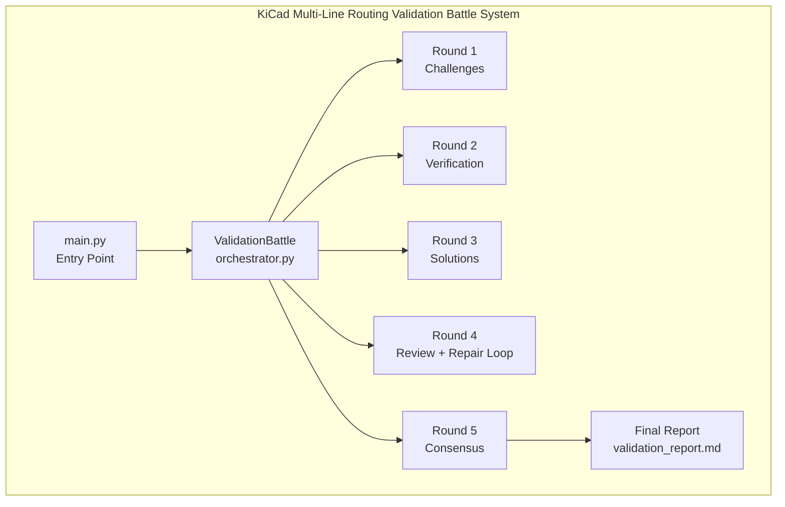

## Agent Architecture

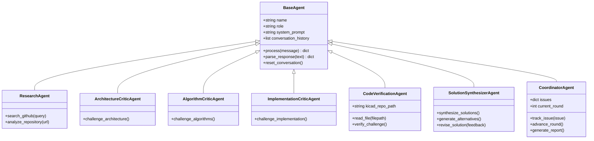

## Communication Flow

### Round 1: Challenges

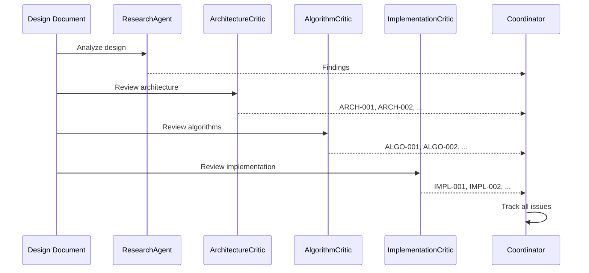

### Round 2: Verification

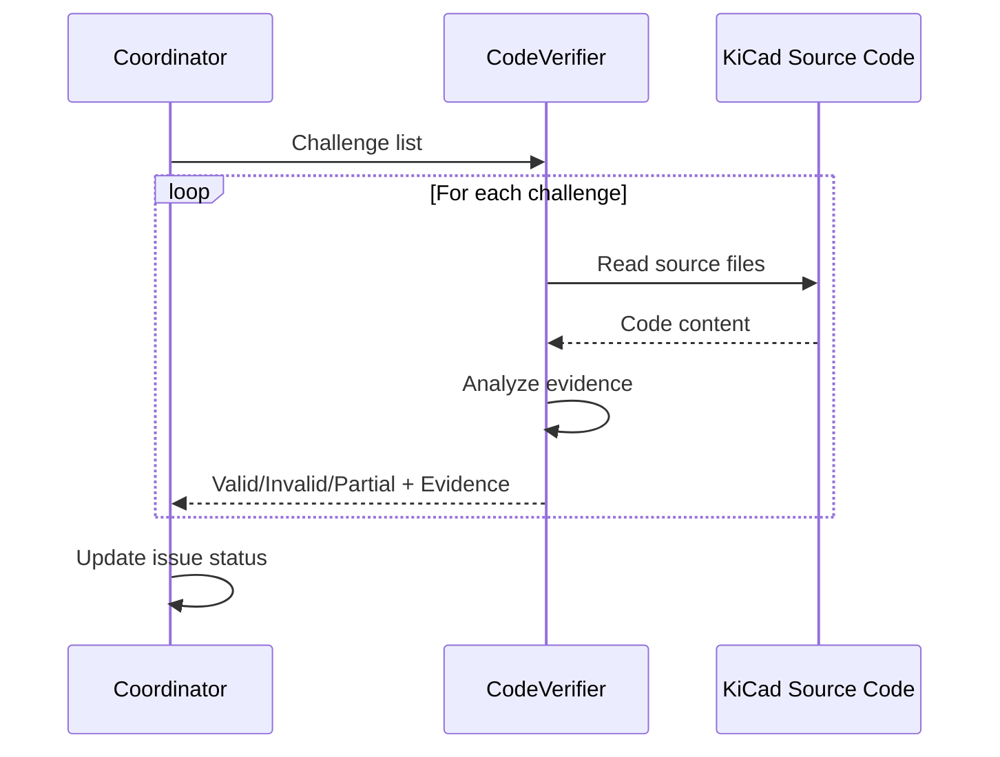

### Round 3: Solutions

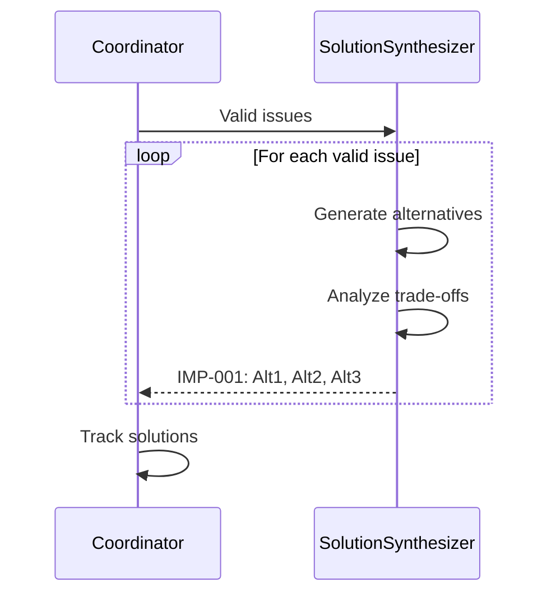

### Round 4: Review + Repair Loop

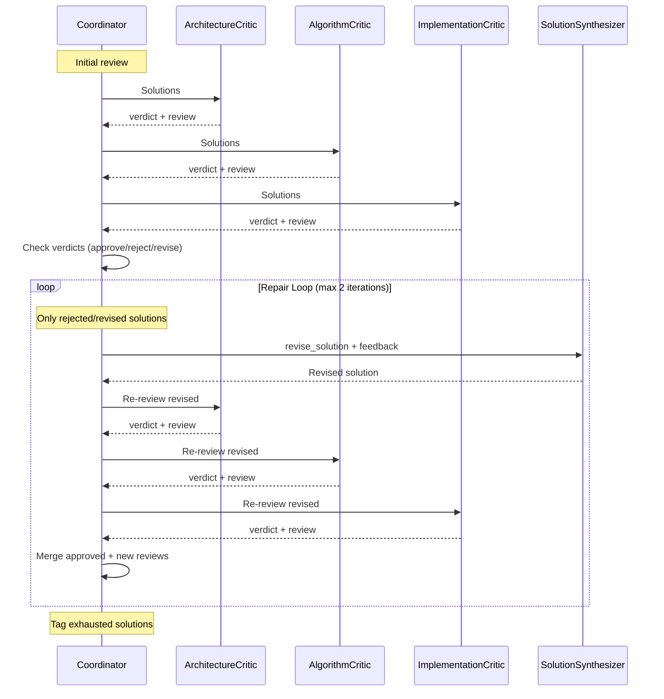

### Round 5: Consensus

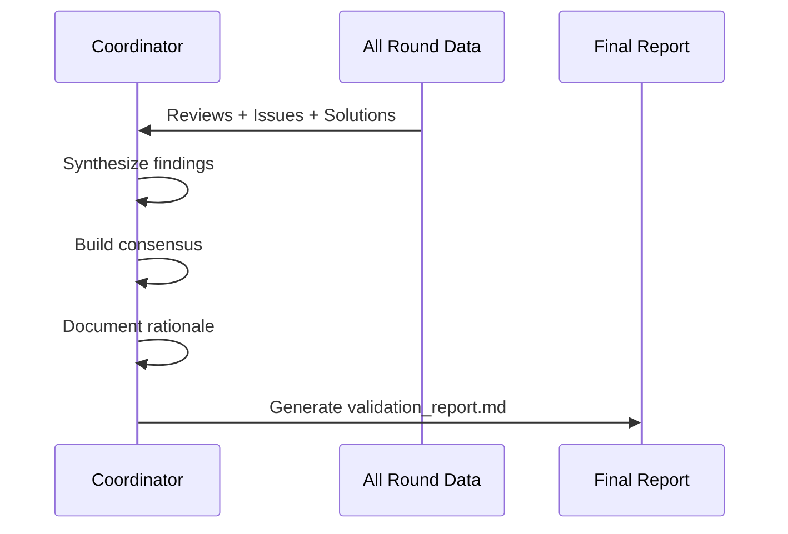

## Data Flow

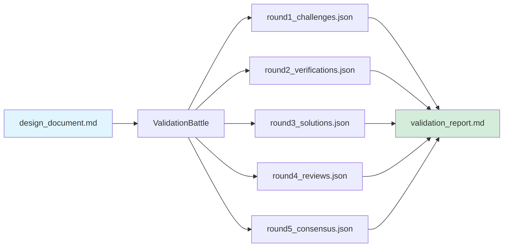

## Technology Stack

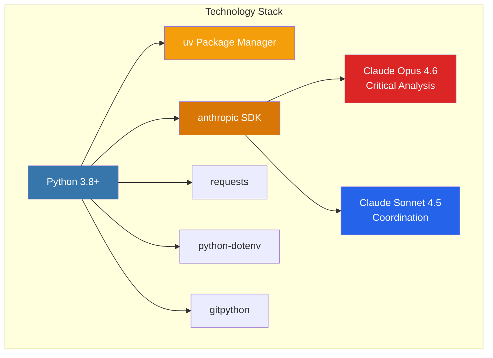

## File Organization

```mermaid
graph TB
    Root[wenming/validation_system/]

    Root --> Agents[agents/]
    Root --> Docs[Documentation]
    Root --> Config[Configuration]
    Root --> Main[Main Files]

    Agents --> BaseAgent[base_agent.py]
    Agents --> Research[research_agent.py]
    Agents --> Critics[*_critic.py x3]
    Agents --> Verifier[code_verifier.py]
    Agents --> Synth[solution_synthesizer.py]
    Agents --> Coord[coordinator.py]

    Docs --> README[README.md]
    Docs --> QuickStart[QUICKSTART.md]
    Docs --> Arch[ARCHITECTURE.md]
    Docs --> Summary[IMPLEMENTATION_SUMMARY.md]
    Docs --> Checklist[CHECKLIST.md]

    Config --> Requirements[requirements.txt]
    Config --> EnvExample[.env.example]
    Config --> ConfigPy[config.py]

    Main --> MainPy[main.py]
    Main --> Orchestrator[orchestrator.py]
    Main --> Test[test_system.py]

    style Root fill:#f59e0b
    style Agents fill:#3b82f6
    style Docs fill:#10b981
    style Config fill:#8b5cf6
    style Main fill:#ef4444
```

## Execution Timeline

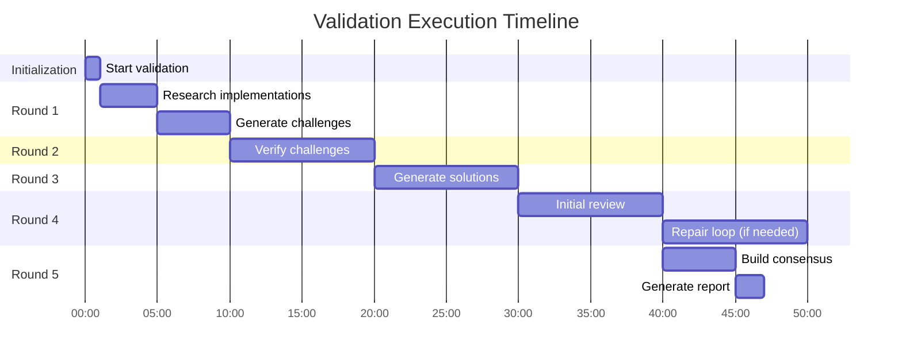

## Agent Interaction Matrix

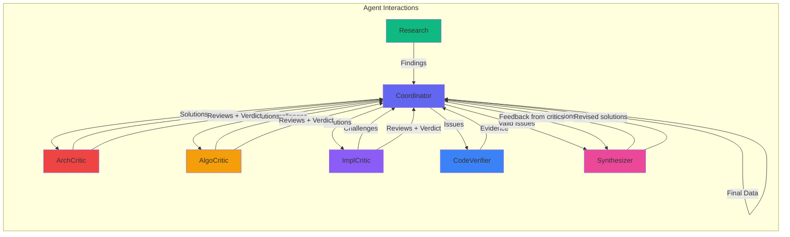

## System State Machine

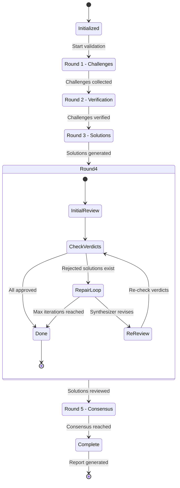

## Deployment Architecture

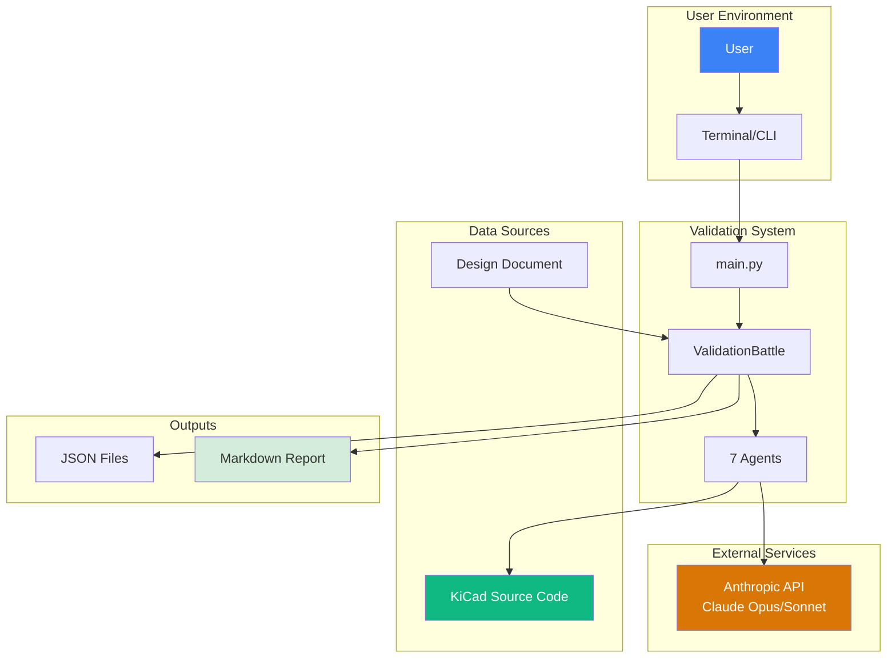

## Cost and Performance Metrics

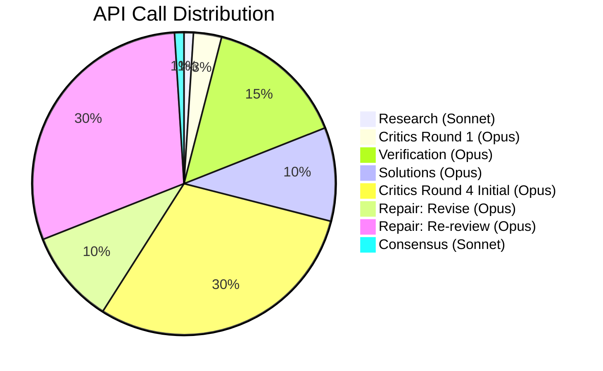

## Error Handling Flow

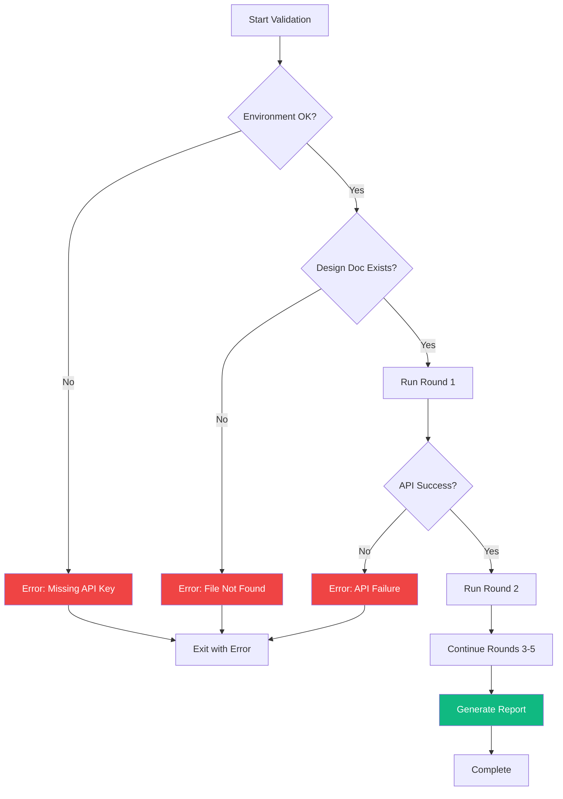

## Package Management with uv

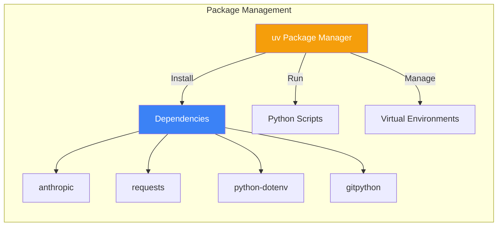

---

## Legend

- **Blue**: Core system components
- **Green**: Data sources and successful outputs
- **Red**: Critical analysis agents
- **Orange**: Research and coordination
- **Purple**: Implementation components
- **Pink**: Solution generation

## Notes

- All diagrams use Mermaid syntax for easy rendering in Markdown viewers
- The system is designed for modularity and extensibility
- Each agent operates independently but coordinates through the orchestrator
- The 5-round workflow ensures thorough validation through multiple perspectives
- Round 4 includes an iterative repair loop (max 2 iterations) where rejected solutions are revised by the synthesizer and re-reviewed by critics, minimizing LLM calls by only re-reviewing revised solutions
- Critics use a structured verdict format (approve/reject/revise) in Round 4 reviews; approval requires >= 2 approves and zero rejects
- Package management is handled by uv for fast and reliable dependency installation
