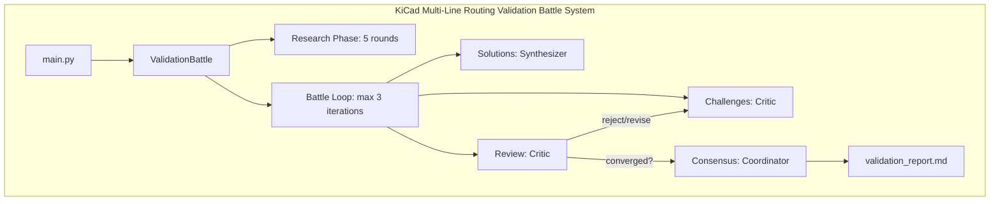
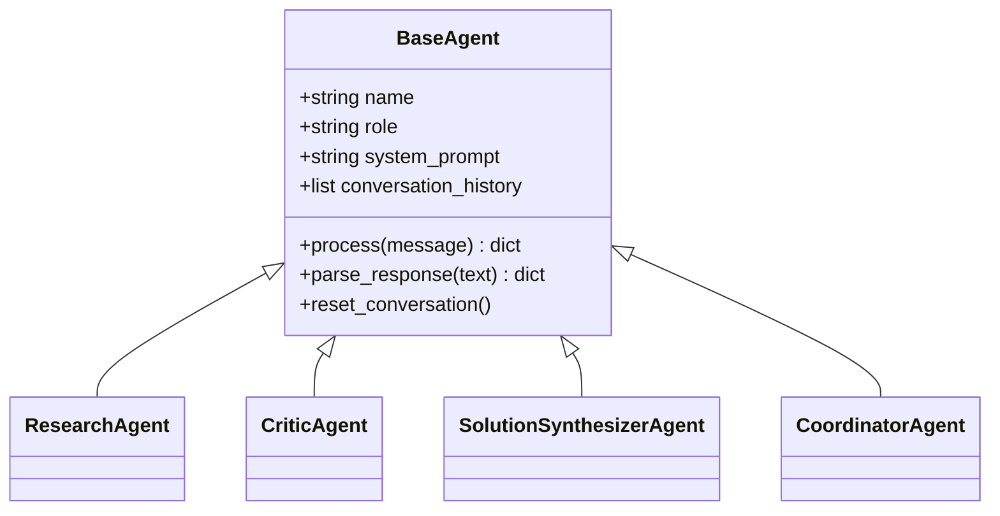
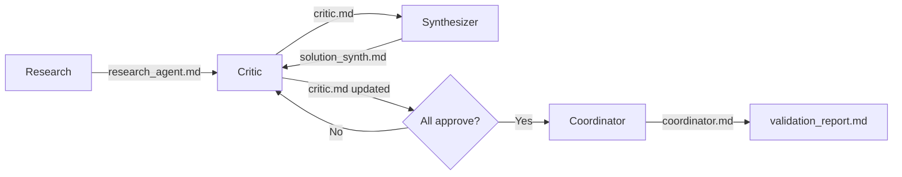
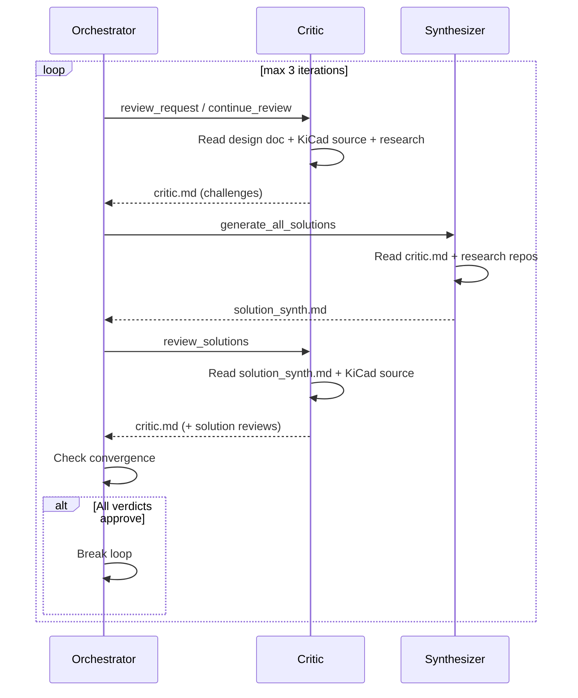

# KiCad Multi-Line Routing Validation System

A multi-agent validation system using Claude SDK to rigorously validate the KiCad multi-line routing design through adversarial debate and evidence-based analysis.

## Overview

The system orchestrates 4 specialized AI agents to challenge, verify, and refine the design:

| Agent | Role | Model |
|---|---|---|
| Research Agent | Analyzes open-source implementations | Sonnet |
| Unified Critic | Challenges design (architecture + algorithm + implementation), verifies against KiCad source | Opus |
| Solution Synthesizer | Generates improved alternatives | Opus |
| Coordinator Agent | Builds final consensus report | Opus |

Validation proceeds through 3 phases:

1. **Research** (once) - 5 rounds of deep exploration across repos and documents
2. **Battle Loop** (max 3 iterations, exits early on convergence):
   - **Challenges** - Critic raises/updates challenges grounded in KiCad source code
   - **Solutions** - Synthesizer generates/updates solutions based on critic challenges
   - **Review** - Critic reviews all solutions with approve/reject/revise verdicts
3. **Consensus** (once) - Coordinator builds final recommendations from all md files

## Directory Structure

```
validation_system/
├── agents/
│   ├── base_agent.py               # Base agent class (SDK integration, retry, history)
│   ├── research_agent.py           # Open-source implementation analysis
│   ├── critic.py                   # Unified critic (arch + algo + impl + source verification)
│   ├── solution_synthesizer.py     # Alternative solution generation
│   └── coordinator.py              # Consensus building & reporting
├── config.py                       # Configuration settings
├── orchestrator.py                 # Battle loop orchestration
├── main.py                         # CLI entry point
├── test_system.py                  # Test suite
├── requirements.txt                # Dependencies
├── .env.example                    # Environment template
└── validation_output/              # Generated reports & markdown
```

## Quick Start

### Prerequisites

- Python 3.8+
- uv package manager
- Anthropic API key (or custom endpoint)

### Installation

```bash
# Install uv (Windows)
powershell -c "irm https://astral.sh/uv/install.ps1 | iex"

# Install uv (macOS/Linux)
curl -LsSf https://astral.sh/uv/install.sh | sh

# Install dependencies
cd wenming/Interactive-multi-routing/validation_system
uv pip install -r requirements.txt

# Configure API key
cp .env.example .env
# Edit .env: set ANTHROPIC_API_KEY=your_key_here
# Optional: set ANTHROPIC_API_BASE=https://your-custom-endpoint.com/api
```

### Verify & Run

```bash
# Verify installation
uv run python test_system.py

# Run full validation
uv run python main.py --design-doc path/to/design_document.md

# Resume from checkpoint
uv run python main.py --design-doc path/to/design_document.md --resume

# Custom output directory
uv run python main.py --output-dir ./my_results
```

### Programmatic Usage

```python
from orchestrator import ValidationBattle

battle = ValidationBattle("/path/to/kicad-source-mirror")
report_path = await battle.execute(
    design_doc_path="./design_document.md",
    output_dir="./validation_output"
)
```

## Output

The system generates markdown files on disk (single source of truth) and a final report:

| File | Content |
|---|---|
| `research_agent.md` | Cumulative research findings across 5 rounds |
| `critic.md` | Unified challenges (CRIT-xxx) with KiCad source evidence + solution reviews |
| `solution_synth.md` | Solutions with alternatives, recommendations, rationale |
| `coordinator.md` | Final consensus report |
| `validation_report.md` | Copy of coordinator.md as the deliverable |
| `checkpoint.json` | Pipeline progress for resume support |

## Architecture Diagrams

### System Overview



### Agent Class Hierarchy



### Agent Interaction Flow



### Battle Loop Detail



## Checkpoint / Resume

The system saves progress after each step via `checkpoint.json`:

```json
{
  "stage": "battle",
  "battle_iteration": 2,
  "last_round": 1
}
```

- `stage`: `init` | `research` | `battle` | `done`
- `battle_iteration`: 1-3 (which iteration of the battle loop)
- `last_round`: 1=challenges, 2=solutions, 3=review (last completed step)

Resume with `--resume` flag. The system skips completed steps and continues from where it left off.

## Validation Findings Summary

Based on 5 rounds of research across 8 repositories and 15+ documents:

**Verdict: Proceed with implementation. No blocking issues found.**

### Key Conclusions

1. **No open-source EDA tool implements general interactive multi-line routing for N>2 traces.** This is genuinely novel work.
2. **The Leader-Follower approach is the only viable architecture for N>2.** The diff-pair gateway approach doesn't scale (2^N combinations), concurrent planning is too slow, sequential backtracking is unreliable.
3. **Corner spacing is a solved problem geometrically.** Clipper2's join algorithms (DoMiter, DoRound, DoSquare) handle all first-phase corner styles.
4. **Obstacle avoidance requires the "fat trace" abstraction.** Route the bundle as a single wide entity, then decompose into individual traces.
5. **Real-time performance is achievable via head/tail split.** Only recalculate the volatile head on each mouse move. R-tree provides O(log N) collision queries.
6. **KiCad's existing infrastructure covers ~70% of the implementation.** Router framework, collision detection, spatial indexing, walkaround, shove, and corner generation are all reusable.

### Repositories Analyzed

| Repository | Key Finding |
|---|---|
| KiCad PNS Router | THE reference. `pns_diff_pair_placer.cpp` is the only open-source multi-trace (2-line) implementation |
| Clipper2 (1.4k stars) | Essential for follower generation. 4 join types directly solve corner spacing. Already a KiCad dependency |
| horizon-eda (900 stars) | Uses KiCad's router v6.0.4. Confirms diff pair limited to 2 traces |
| freerouting (800 stars) | Does NOT support multi-line routing |
| CGAL (4.8k stars) | Exact polygon offset via Minkowski sum. Too heavyweight for interactive routing |
| LibrePCB (2.1k stars) | No multi-line routing. Single-trace only |

### Validated First-Phase Features

- **Corner Styles:** MITERED_45, Miter/Chamfer, Rounded/Fillet - all validated with concrete implementation paths
- **Obstacle Avoidance:** STRICT, WALKAROUND (default), PUSH_SHOVE, HIGHLIGHT_ONLY - all validated
- **Spacing:** Uniform user-set spacing (Plan B) - validated with DRC integration
- **Performance:** Incremental computation (head/tail split) + R-tree spatial indexing - target <16ms/frame

### Risk Matrix

| Risk | Severity | Mitigation |
|---|---|---|
| Follower-obstacle collision after leader walkaround | Medium | Expand walkaround hull by bundle width; fallback to per-trace walkaround |
| Miter spikes at acute angles violating DRC | High | Implement miter limit with bevel fallback from day one |
| Performance degradation at N>8 traces | Medium | Profile early; use coarser collision detection for preview |
| Inner arc radius below minimum | Medium | Validate at routing start; increase leader radius or warn user |

### Deferred Features (NOT in first phase)

MITERED_90, any-angle routing, per-net-pair DRC spacing matrix, deferred precise computation, parallel computation for N>8, layer switching, length matching, signal integrity, differential pair coupling.

## Key Functions to Reuse

| Function | Source | Purpose |
|---|---|---|
| `BuildInitialTrace()` | `direction_45.cpp` | Generate leader path with corner styles |
| `makeGapVector()` | `pns_diff_pair.cpp` | Perpendicular offset with integer rounding |
| `WALKAROUND::Route()` | `pns_walkaround.cpp` | Leader obstacle avoidance |
| `SHOVE::ShoveObstacleLine()` | `pns_shove.cpp` | Push-and-shove for bundle |
| `ConvexHull()` | `pns_utils.cpp` | Octagonal hull for walkaround |
| `INDEX::Query()` | `pns_index.h` | R-tree collision detection |
| `DoMiter()/DoRound()/DoSquare()` | Clipper2 `clipper.offset.cpp` | Corner join algorithms for followers |

## Configuration

Edit `config.py` to customize model selection (Opus vs Sonnet per agent), output paths, and validation parameters.

**Custom API Endpoint:** Set `ANTHROPIC_API_BASE` in `.env` to use a third-party Claude API proxy. Leave unset for official Anthropic API.

## Troubleshooting

| Error | Solution |
|---|---|
| `ANTHROPIC_API_KEY not set` | Create `.env` file with `ANTHROPIC_API_KEY=your_key_here` |
| `ModuleNotFoundError` | Run `uv pip install -r requirements.txt` |
| `Design document not found` | Provide correct absolute path via `--design-doc` |
| `KiCad repository not found` | Provide correct path via `--kicad-repo` |
| Unicode errors (Windows) | Set `PYTHONIOENCODING=utf-8` or use PowerShell |

## Extending the System

- **New agents:** Inherit from `BaseAgent`, define system prompt, add to `orchestrator.py`
- **Battle loop steps:** Add step method to `ValidationBattle`, update `run_battle_loop()` and checkpoint `last_round` max

## Dependencies

- `anthropic` >= 0.40.0 (Claude SDK)
- `requests` >= 2.31.0
- `python-dotenv` >= 1.0.0
- `gitpython` >= 3.1.40

## License

Provided as-is for validating KiCad designs. See KiCad license for source code references.
